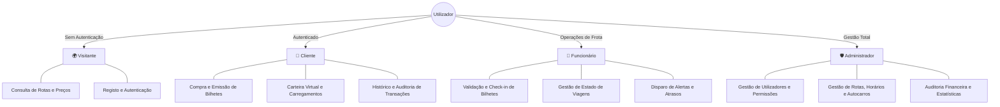
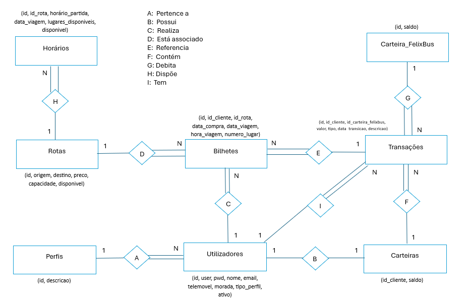

# 🚌 FelixBus — Plataforma Dual-Stack de Gestão de Viagens (PHP & Java JSP)

<p align="left">
  
  
  
  
  
  
  
  
  
</p>

> **Projeto Académico de Linguagens de Programação para a Internet (LPI)**  
> Licenciatura em Engenharia Informática — Escola Superior de Tecnologia (EST) / Instituto Politécnico de Castelo Branco (IPCB).  
> **Autores:** João Resina & Rafael Cruz

---

## 📌 Visão Geral & Abordagem Dual-Stack

O **FelixBus** é uma plataforma web para gestão de reservas de viagens rodoviárias de passageiros, desenvolvida em duas implementações de referência independentes que partilham a mesma base de dados relacional:
1. **Stack PHP 8.x + Apache HTTP Server (Runtime Interpretado)**
2. **Stack Java JSP / Servlets + Apache Tomcat (Runtime Compilado na JVM)**

O sistema implementa controlo de acessos baseado em perfis (**RBAC** com 4 níveis), emissão eletrónica de bilhetes, gestão de rotas e horários em tempo real, e uma **carteira virtual com auditoria transacional estrita**.

---

## ⚖️ Comparativo Arquitetural Dual-Stack

| Dimensão / Camada | Implementação PHP (`/php`) | Implementação Java / JSP (`/jsp`) |
| :--- | :--- | :--- |
| **Servidor Web / Container** | Apache HTTP Server (mod_php / XAMPP) | Apache Tomcat 9+ (Servlet Engine) |
| **Acesso a Dados & Driver** | PHP MySQLi Extension (`mysqli_connect`) | Java JDBC Connector/J (`com.mysql.cj.jdbc.Driver`) |
| **Gestão de Sessão & RBAC** | Sessões Nativas PHP (`$_SESSION['id_perfil']`) | Java Servlet Session (`session.getAttribute("id_perfil")`) |
| **Renderização de Vistas** | PHP Native Templating & Includes | JSP Dynamic Pages & Scriptlets |
| **Tratamento de Exceções** | `mysqli_connect_error()` & Fallbacks | `try-catch` com `SQLException` & `ClassNotFoundException` |
| **Base de Dados Partilhada** | MySQL 8.x (`basedados/felixbus.sql`) | MySQL 8.x (`basedados/felixbus.sql`) |

---

## 👥 Funcionalidades por Perfil de Utilizador (RBAC)



### 🌍 1. Visitante (Anónimo)
* Consulta pública do catálogo de rotas, paragens e horários disponíveis.
* Pesquisa dinâmica de viagens por origem, destino e data.
* Módulo de registo de nova conta e autenticação com validação de credenciais.

### 👤 2. Cliente
* **Gestão de Perfil:** Atualização de dados pessoais e credenciais.
* **Carteira Virtual (Wallet):** Carregamento de saldo, débito automático em compras e consulta do extrato detalhado de movimentos.
* **Reserva & Emissão de Bilhetes:** Seleção de lugares, compra com saldo da carteira e geração de bilhetes com código de identificação único.
* **Histórico de Viagens:** Consulta de bilhetes ativos e passados com opção de cancelamento de acordo com a política de reembolsos.

### 👷 3. Funcionário (Operador de Bordo / Terminal)
* **Validação de Embarque:** Leitura e validação de bilhetes de passageiros no momento do check-in.
* **Monitorização de Viagens:** Atualização do estado operacional das viagens (Em trânsito, Concluída, Atrasada).
* **Gestão de Alertas:** Emissão de avisos operacionais instantâneos visíveis aos passageiros da rota.

### 🛡️ 4. Administrador
* **Gestão Global de Utilizadores:** Listagem, ativação/bloqueio de contas e atribuição de perfis.
* **Gestão de Frota e Rotas:** Criação, edição e remoção de rotas, definição de paragens intermédias, alocação de autocarros e calendarização de horários.
* **Auditoria Financeira:** Relatórios consolidados de receitas, carregamentos de carteira e volume global de bilhetes emitidos.

---

## 🗄️ Modelo Relacional da Base de Dados (MySQL)

A base de dados encontra-se normalizada até à **3ª Forma Normal (3NF)** com integridade referencial estrita (`ON DELETE RESTRICT / CASCADE`):

```text
├── utilizadores        # Credenciais, hash de passwords e estado da conta
├── perfis              # Níveis de permissão (Visitante, Cliente, Funcionário, Admin)
├── carteiras           # Saldo atual de cada cliente
├── transacoes          # Registo imutável de carregamentos, débitos e reembolsos
├── autocarros          # Frota disponível, matrículas e capacidade de lotação
├── rotas               # Pontos de origem, destino e distância
├── horarios            # Partidas, chegadas, autocarro alocado e estado da viagem
├── bilhetes            # Emissões de bilhetes associadas a utilizadores e horários
└── alertas             # Notificações e avisos de atraso/incidentes
```

<p align="center">
  
</p>

---

## 📂 Estrutura do Repositório

```text
felixbus-travel-platform/
│
├── basedados/                 # Esquema MySQL comum e scripts de povoamento
│   ├── felixbus.sql           # Schema DDL principal com 9 tabelas relacionais
│   ├── criar_bd.sql           # Script alternativo de inicialização
│   └── apagar_bd.sql          # Script de teardown / limpeza
│
├── php/                       # 🐘 Implementação em PHP 8.x + Apache HTTPD
│   ├── basedados/             # Módulo ligabd.php (Conexão MySQLi)
│   └── paginas/               # Controladores e vistas PHP
│
├── jsp/                       # ☕ Implementação em Java / JSP + Apache Tomcat
│   ├── basedados/             # Módulo basedados.jsp (Conexão JDBC MySQL)
│   └── paginas/               # Ficheiros .jsp, estilos CSS e assets gráficos
│
├── screenshots/               # Capturas de ecrã dos módulos da aplicação
│   ├── PaginaHome.PNG
│   ├── PaginaLogin.PNG
│   ├── GestãoDeBilhetes.PNG
│   └── PaginaPaineldeAdministração.PNG
│
├── relatorio/                 # Documentação académica e especificações
│   ├── Modelo_ER.png          # Diagrama Entidade-Relacionamento
│   ├── Casos_de_Uso.png       # Diagrama de Casos de Uso
│   ├── Relatorio_LPI.pdf      # Relatório técnico do projeto
│   └── Criterios_Avaliacao.pdf # Critérios pedagógicos da UC
│
├── .gitignore                 # Exclusões para PHP e Java/Tomcat
├── LICENSE                    # Licença MIT
└── README.md                  # Documentação do projeto
```

---

## 🚀 Instalação e Execução Local

### 1. Base de Dados Comum (MySQL)
1. Abre o **phpMyAdmin** (`http://localhost/phpmyadmin`) ou o terminal do MySQL.
2. Cria e popula a base de dados a partir de `basedados/felixbus.sql`:
   ```bash
   mysql -u root -p < basedados/felixbus.sql
   ```

---

### 2. Execução da Versão PHP (Apache / XAMPP)
1. Coloca a pasta `php/` dentro de `htdocs` (ex.: `C:\xampp\htdocs\felixbus-php`).
2. Verifica as credenciais em `php/basedados/ligabd.php` (`localhost`, `root`, sem password).
3. Inicia o **Apache** e **MySQL** no XAMPP Control Panel.
4. Acede no navegador:
   ```text
   http://localhost/felixbus-php/paginas/index.php
   ```

---

### 3. Execução da Versão Java / JSP (Apache Tomcat)
1. Coloca a pasta `jsp/` dentro do diretório `webapps` do Apache Tomcat (ex.: `C:\apache-tomcat-9.x\webapps\felixbus-jsp`).
2. Garante que o driver JDBC `mysql-connector-j-8.x.jar` se encontra em `tomcat/lib/`.
3. Inicia o servidor Tomcat através do executável `startup.bat` (ou via Eclipse / NetBeans).
4. Acede no navegador:
   ```text
   http://localhost:8080/felixbus-jsp/paginas/index.jsp
   ```

---

## 👥 Autores & Créditos

* **João Resina** — Licenciatura em Engenharia Informática (IPCB)
* **Rafael Cruz** — [LinkedIn](https://linkedin.com/in/rafael-cruz-7159092b2) | [GitHub](https://github.com/RafaCr3z)
* **Instituição:** Escola Superior de Tecnologia (EST) — Instituto Politécnico de Castelo Branco (IPCB)
* **Unidade Curricular:** Linguagens de Programação para a Internet (LPI)

---
<p align="center">
  <sub>Desenvolvido no âmbito académico com foco em engenharia web dual-stack, segurança de sessões e integridade de dados.</sub>
</p>
