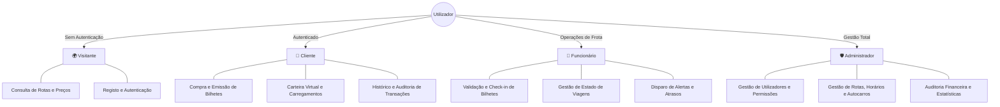

# 🚌 FelixBus — Plataforma de Gestão de Viagens de Autocarro

<p align="left">
  
  
  
  
  
  
  
</p>

> **Projeto Académico de Linguagens de Programação para a Internet (LPI)**  
> Licenciatura em Engenharia Informática — Escola Superior de Tecnologia (EST) / Instituto Politécnico de Castelo Branco (IPCB).  
> **Autores:** João Resina & Rafael Cruz

---

## 📌 Visão Geral do Projeto

O **FelixBus** é uma aplicação web desenvolvida para a gestão e reserva de viagens rodoviárias de passageiros. O sistema implementa controlo de acessos baseado em perfis (**RBAC**), emissão e validação eletrónica de bilhetes, gestão de rotas e horários em tempo real, e um sistema de **carteira virtual com auditoria transacional estrita**.

---

## 👥 Funcionalidades por Perfil de Utilizador

O sistema encontra-se segmentado em **4 níveis de privilégios e permissões**:



### 🌍 1. Visitante (Anónimo)
* Consulta pública do catálogo de rotas, paragens e horários disponíveis.
* Pesquisa dinâmica de viagens por origem, destino e data.
* Módulo de registo de nova conta e autenticação com gestão segura de sessões PHP.

### 👤 2. Cliente
* **Gestão de Perfil:** Atualização de dados pessoais e credenciais.
* **Carteira Virtual (Wallet):** Carregamento de saldo, débito automático em compras e consulta do extrato detalhado de movimentos.
* **Reserva & Emissão de Bilhetes:** Seleção de lugares, compra com saldo da carteira e geração de bilhetes com código de identificação único.
* **Histórico de Viagens:** Consulta de bilhetes ativos e passados com opção de cancelamento de acordo com a política de reembolsos.

### 👷 3. Funcionário (Operador de Bordo / Terminal)
* **Validação de Embarque:** Leitura e validação de bilhetes de passageiros no momento do check-in.
* **Monitorização de Viagens:** Atualização do estado operacional das viagens (Em trânsito, Concluída, Atrasada).
* **Gestão de Alertas:** Emissão de avisos operacionais instantâneos visíveis aos passageiros da rota.

### 🛡️ 4. Administrador
* **Gestão Global de Utilizadores:** Listagem, ativação/bloqueio de contas e atribuição de perfis.
* **Gestão de Frota e Rotas:** Criação, edição e remoção de rotas, definição de paragens intermédias, alocação de autocarros e calendarização de horários.
* **Auditoria Financeira:** Relatórios consolidados de receitas, carregamentos de carteira e volume global de bilhetes emitidos.

---

## 🗄️ Modelo e Arquitetura da Base de Dados

O modelo relacional em **MySQL** foi desenhado com integridade referencial estrita e normalização até à 3ª Forma Normal (3NF):

```text
├── utilizadores        # Credenciais, hash de passwords e estado da conta
├── perfis              # Níveis de permissão (Visitante, Cliente, Funcionário, Admin)
├── carteiras           # Saldo atual de cada cliente
├── transacoes          # Registo imutável de carregamentos, débitos e reembolsos
├── autocarros          # Frota disponível, matrículas e capacidade de lotação
├── rotas               # Pontos de origem, destino e distância
├── horarios            # Partidas, chegadas, autocarro alocado e estado da viagem
├── bilhetes            # Emissões de bilhetes associadas a utilizadores e horários
└── alertas             # Notificações e avisos de atraso/incidentes
```

<p align="center">
  
</p>

---

## 📂 Estrutura do Repositório

```text
TrabalhoLPI/
│
├── basedados/                 # Scripts SQL de criação e módulo de ligação
│   ├── felixbus.sql           # Schema DDL e dados relacionais
│   └── ligabd.php             # Módulo de ligação MySQLi com suporte UTF-8
│
├── screenshots/               # Capturas de ecrã dos módulos da aplicação
│   ├── PaginaHome.PNG
│   ├── PaginaLogin.PNG
│   ├── GestãoDeBilhetes.PNG
│   └── PaginaPaineldeAdministração.PNG
│
├── relatorio/                 # Documentação académica e especificações
│   ├── Modelo_ER.png          # Diagrama Entidade-Relacionamento
│   ├── Casos_de_Uso.png       # Diagrama de Casos de Uso
│   └── Relatorio_LPI.pdf      # Relatório técnico do projeto
│
├── .gitignore                 # Regras de exclusão de ficheiros temporários
├── LICENSE                    # Licença MIT
└── README.md                  # Documentação do projeto
```

---

## 🚀 Instalação e Configuração Local

### Pré-requisitos
* Servidor Web **Apache** e interpretador **PHP 7.4+ ou 8.x** (ex.: [XAMPP](https://www.apachefriends.org/), WampServer ou Docker).
* Sistema de Gestão de Base de Dados **MySQL / MariaDB**.

### Passo a Passo

#### 1. Clonar o Repositório
Coloca o projeto dentro da pasta `htdocs` do teu servidor Apache (ex.: `C:\xampp\htdocs\TrabalhoLPI`):
```bash
git clone https://github.com/RafaCr3z/TrabalhoLPI.git
```

#### 2. Importar a Base de Dados
1. Abre o **phpMyAdmin** (`http://localhost/phpmyadmin`) ou o terminal do MySQL.
2. Cria a base de dados `felixbus`:
   ```sql
   CREATE DATABASE felixbus CHARACTER SET utf8mb4 COLLATE utf8mb4_unicode_ci;
   ```
3. Importa o esquema SQL localizado em `basedados/felixbus.sql`:
   ```bash
   mysql -u root -p felixbus < basedados/felixbus.sql
   ```

#### 3. Configurar a Conexão à Base de Dados
Verifica o ficheiro `basedados/ligabd.php` e confirma as credenciais locais:
```php
<?php
$servidor   = "localhost";
$utilizador = "root";
$password   = "";
$basedados  = "felixbus";

$conn = mysqli_connect($servidor, $utilizador, $password, $basedados);

if (!$conn) {
    die("Falha na ligação à base de dados: " . mysqli_connect_error());
}
?>
```

#### 4. Executar a Aplicação
Inicia os módulos **Apache** e **MySQL** no XAMPP e acede no teu navegador a:
```text
http://localhost/TrabalhoLPI
```

---

## 👥 Autores & Créditos

* **João Resina** — Licenciatura em Engenharia Informática (IPCB)
* **Rafael Cruz** — [LinkedIn](https://linkedin.com/in/rafael-cruz-7159092b2) | [GitHub](https://github.com/RafaCr3z)
* **Instituição:** Escola Superior de Tecnologia (EST) — Instituto Politécnico de Castelo Branco (IPCB)
* **Unidade Curricular:** Linguagens de Programação para a Internet (LPI)

---
<p align="center">
  <sub>Desenvolvido no âmbito académico com foco em desenvolvimento web modular, segurança de sessões e integridade de dados.</sub>
</p>
